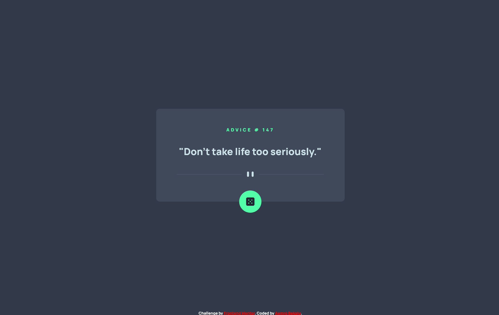
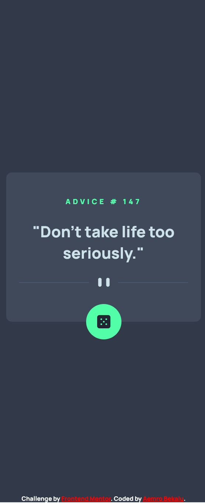

# Frontend Mentor - Advice generator app solution

This is a solution to the [Advice generator app challenge on Frontend Mentor](https://www.frontendmentor.io/challenges/advice-generator-app-QdUG-13db). Frontend Mentor challenges help you improve your coding skills by building realistic projects.

## Table of contents

- [Overview](#overview)
  - [The challenge](#the-challenge)
  - [Screenshot](#screenshot)
  - [Links](#links)
- [My process](#my-process)
  - [Built with](#built-with)
  - [What I learned](#what-i-learned)
  - [Continued development](#continued-development)
  - [Useful resources](#useful-resources)
- [Author](#author)

## Overview

### The challenge

Users should be able to:

- View the optimal layout for the app depending on their device's screen size
- See hover states for all interactive elements on the page
- Generate a new piece of advice by clicking the dice icon

### Screenshot

-desktop-view


-mobile-view


### Links

- Solution URL: [solution URL](https://www.frontendmentor.io/solutions/advice-generator-app-first-challenge-which-invovle-an-api-ECcGaG91RB)
- Live Site URL: [live site URL](https://aemrobe.github.io/advice-generator-app-main/)

## My process

### Built with

- Semantic HTML5 markup
- CSS custom properties
- Flexbox
- javascript
- Mobile-first workflow

### What I learned

this is the first challenge which I have incorporated about an api after I have covered a section of the course which talks about the api. I will explain about how I use async and await in the challenge
the keyword async is used to make the function asynchrnous which means to run in the background. and inside the async function we use await to wait until the promise which is returned by asynchronous function.
forexample:- this code will fetch the code fetch("https://api.adviceslip.com/advice") and return a promise. we will fetch the api inside the asynchrnous function and we will wait it's value by using the await keyword

```js
// asynchronous function
const generateAdvice = async function () {
  //we use try catch block inorder to handle the error which is happened during the process of generation of an advice from an api
  try {
    //we will use the fetch api to fetch the data from the api and return a promise and we will use the await keyword to get it's value
    const res = await fetch("https://api.adviceslip.com/advice");

    //this is where we handle an error. to return a word "advice not found" when the url which is used inside the api is invalid
    if (!res.ok) throw new Error("advice not found");

    const data = await res.json();

    const {
      slip: { id, advice },
    } = data;

    //displaying the advice id
    adviceId.textContent = `advice # ${id}`;

    //displaying the advice text
    adviceText.textContent = `"${advice}"`;
  } catch (err) {
    //in this catch block we can access to the error which is happend during the generation of advice in the try block.
for example:- if the internet connection is not good enough to be able to make the fetch api to get the data,
if the url is invalid which is used in the fetch api and we will display that error to the user in the below code.
    adviceText.textContent = `${err}`;
  }
};
```

### Continued development

I am about to finish my javascript course and I will continue to work on javascript involving challenges

### Useful resources

- [the complete javascript course by jonas schmedtmann](https://www.udemy.com/course/the-complete-javascript-course/) - This helped me for learning how can I work with an api.

## Author

- Frontend Mentor - [@aemrobe](https://www.frontendmentor.io/profile/aemrobe)
- Twitter - [@Aemro112](https://www.twitter.com/Aemro112)
